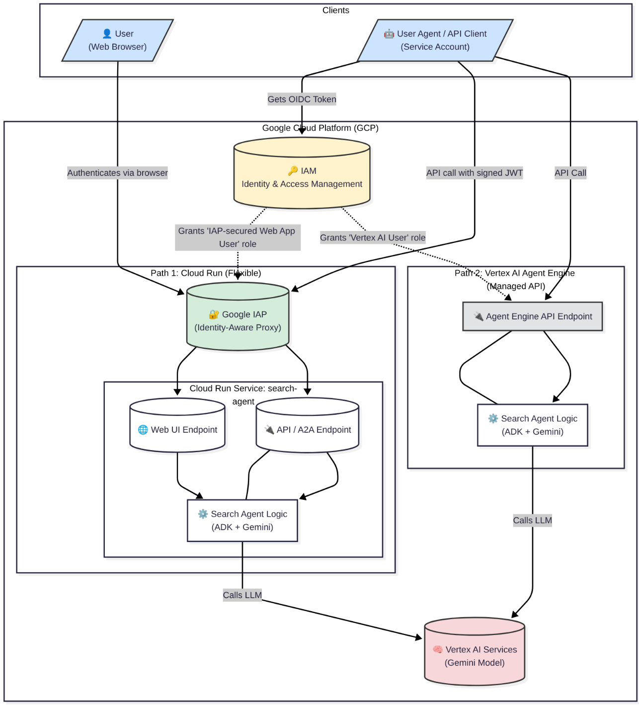

# Gemini Agent on GCP with ADK

[](https://opensource.org/licenses/MIT)
[](https://www.python.org/downloads/release/python-3130/)

This project provides a comprehensive example of how to build and deploy a secure, enterprise-ready [Gemini-powered agent](https://cloud.google.com/vertex-ai/generative-ai/docs/models#gemini-models) on the [Google Cloud Platform](https://cloud.google.com/?hl=en) using the [Agent Development Kit (ADK)](https://google.github.io/adk-docs/).

It showcases a primary [`search agent`](search_agent/) and a test [`user agent`](user_agent/) to demonstrate secure [agent-to-agent (A2A) communication](https://google.github.io/adk-docs/a2a/intro/).

To learn more about the deployment of Agent in the Entreprise, check out the associated Medium article: [Deploying AI Agents in the Enterprise without Losing your Humanity using ADK and Google Cloud](https://fmind.medium.com/deploying-ai-agents-in-the-enterprise-using-adk-and-google-cloud-b49e7eda3b41).



## Prerequisites

Before you begin, ensure you have the following tools installed:

- **[uv](https://github.com/astral-sh/uv)**: An extremely fast Python package installer and resolver.
- **[Google Cloud SDK](https://cloud.google.com/sdk/docs/install)**: For interacting with your GCP account.

## Architecture

The project demonstrates two primary [deployment targets](https://google.github.io/adk-docs/deploy/) and secure communication patterns:

1. **User to Agent**: A user interacts with the agent through a web UI hosted on a private [Cloud Run](https://cloud.google.com/run?hl=en) instance.
2. **Agent to Agent (A2A)**: A separate `user_agent` securely communicates with the main `search_agent` by exchanging [JSON Web Token](https://www.jwt.io/) (JWT).

Here is a simplified diagram of the architecture:

```text
   +----------------+      +----------------------+      +------------------------+
   |      User      |----->|  Private Cloud Run   |----->|   Vertex AI Services   |
   | (Web Browser)  |      | (search_agent UI)    |      | (Gemini models, etc.)  |
   +----------------+      +----------------------+      +------------------------+
                                     ^
                                     | (same instance)
                                     |
+----------------------+      +----------------------+
|     user_agent       |----->|  Private Cloud Run   |
| (Another service)    |      | (search_agent A2A)   |
+----------------------+      +----------------------+
```

## Project Structure

- **`search_agent/`**: Contains the primary search agent, built with the ADK.
- **`user_agent/`**: A simple agent to demonstrate how to use the [A2A integration](https://google.github.io/adk-docs/a2a/quickstart-consuming/).
- **`tests/`**: Python scripts to test the agent in different environments (local, Cloud Run, Agent Engine).
- **`justfile`**: Defines automation commands for setup, deployment, and testing.
- **`.env.sample`**: A template for environment variables.
- **`pyproject.toml`**: Manages Python dependencies via `uv`.

## Authentication and Security

This project emphasizes a secure-by-default posture:

1. **Private Cloud Run Services**: During deployment (`just deploy-cloud-run`), **the script explicitly disallows unauthenticated invocations**. This ensures your agent endpoints are not publicly accessible.
2. **IAM-based Access Control**: Interaction with the agent requires proper authentication and authorization. This is managed through a dedicated service account (`AGENT_RUN_SA`).
3. **Secure A2A Communication**: For agent-to-agent communication, the calling agent (`user_agent`) must use the credentials of an authorized service account to invoke the `search_agent`.

## `justfile` Tasks

The [`justfile`](https://github.com/casey/just) provides the following commands:

- `just cloud`: Initializes your GCP environment (login, set project, enable APIs).
- `just deploy-agent-engine`: Deploys the agent to a private Vertex AI Agent Engine.
- `just deploy-cloud-run`: Deploys the agent to a private Cloud Run service.
- `just deploy`: Deploys to both Agent Engine and Cloud Run.
- `just install`: Installs Python dependencies.
- `just test-agent-engine`: Tests the Agent Engine deployment.
- `just test-cloud-run`: Tests the Cloud Run deployment.
- `just test-local`: Tests the agent locally.
- `just test`: Runs all tests.
- `just web`: Starts a local development server with a web UI.

## Setup and Deployment

1. **Clone the repository**:

    ```bash
    git clone https://github.com/fmind/search-agent
    cd search-agent
    ```

2. **Install dependencies**:

    ```bash
    uv sync
    ```

3. **Configure your environment**:
    - Copy `.env.sample` to `.env`: `cp .env.sample .env`
    - Edit `.env` and fill in your GCP details.

4. **Initialize GCP**:

    ```bash
    just cloud
    ```

5. **Deploy the agent**:

    ```bash
    just deploy
    ```

    **Important**: When prompted to "Allow unauthenticated invocations" for Cloud Run, answer **`n`** to keep your agent secure.

6. **Run locally (optional)**:

    ```bash
    just web
    ```

7. **Test the deployments**:

    ```bash
    just test
    ```

## License

This project is licensed under the MIT License - see the [LICENSE.txt](LICENSE.txt) file for details.
